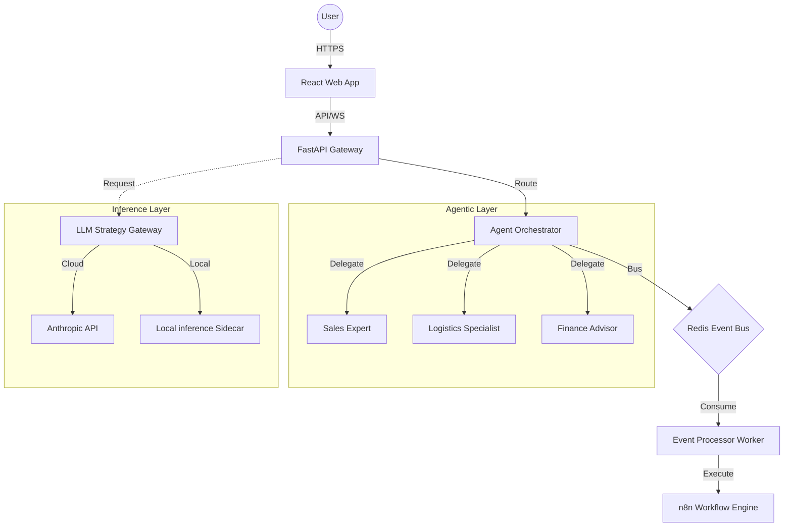

# Architecture: AI Workflow Platform (2026 Edition)

## 🏗 System Architecture

The platform follows a modular, agentic-first design to ensure long-term adaptability.

### 1. High-Level Component Flow

### 2. Multi-Agent System (MAS)
The `AgentOrchestrator` implements a routing-and-delegation pattern. It analyzes user intent and maintains a stateful `AgentState` object that stores findings from different specialized agents throughout the conversation.

### 3. Event-Driven Scalability
By utilizing Redis Streams, the platform decouples heavy workflow creation and execution from the synchronous user interface. This ensures that the system remains responsive even during high-load peaks.

### 4. Security & Privacy foundation
- **Hybrid Cryptography**: Implements AES-GCM for current standards with structural hooks for Post-Quantum KEM (Key Encapsulation Mechanisms).
- **Privacy-Safe Inference**: Sensitive Algerian business data (e.g. CCP numbers, internal invoices) can be routed to the local inference container instead of external APIs.

### 5. Governance & Auditability
Every generated workflow is accompanied by an **SBOM (Software Bill of Materials)**. This JSON document traces:
- Model versions used (e.g. `claude-3-5-sonnet-20240620`).
- Prompt templates and roles.
- Component dependencies within the n8n engine.
